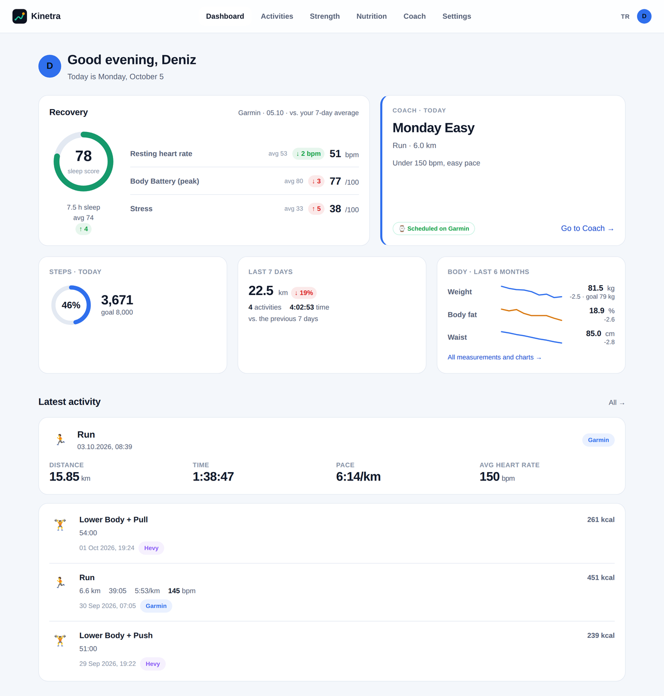
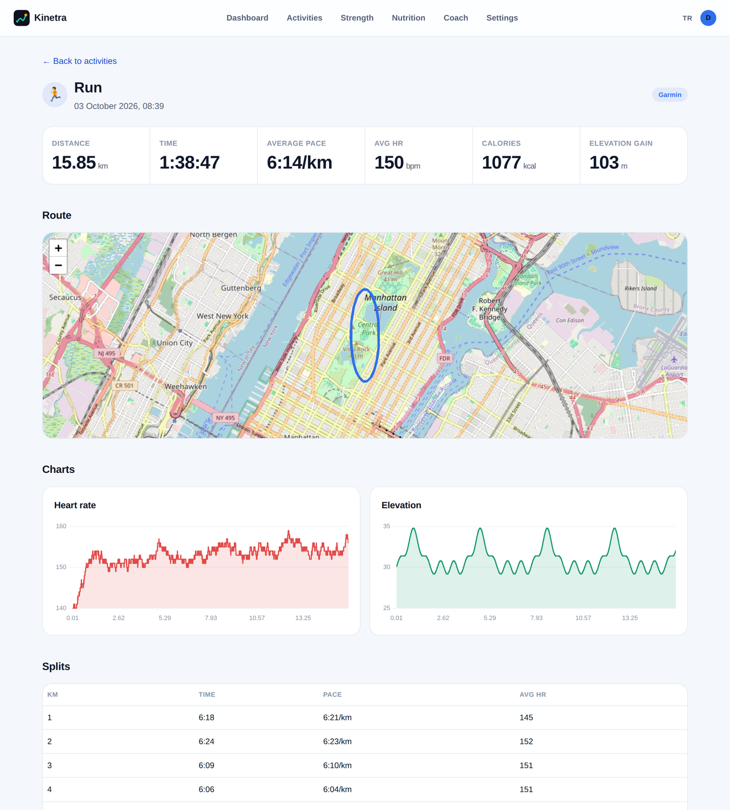
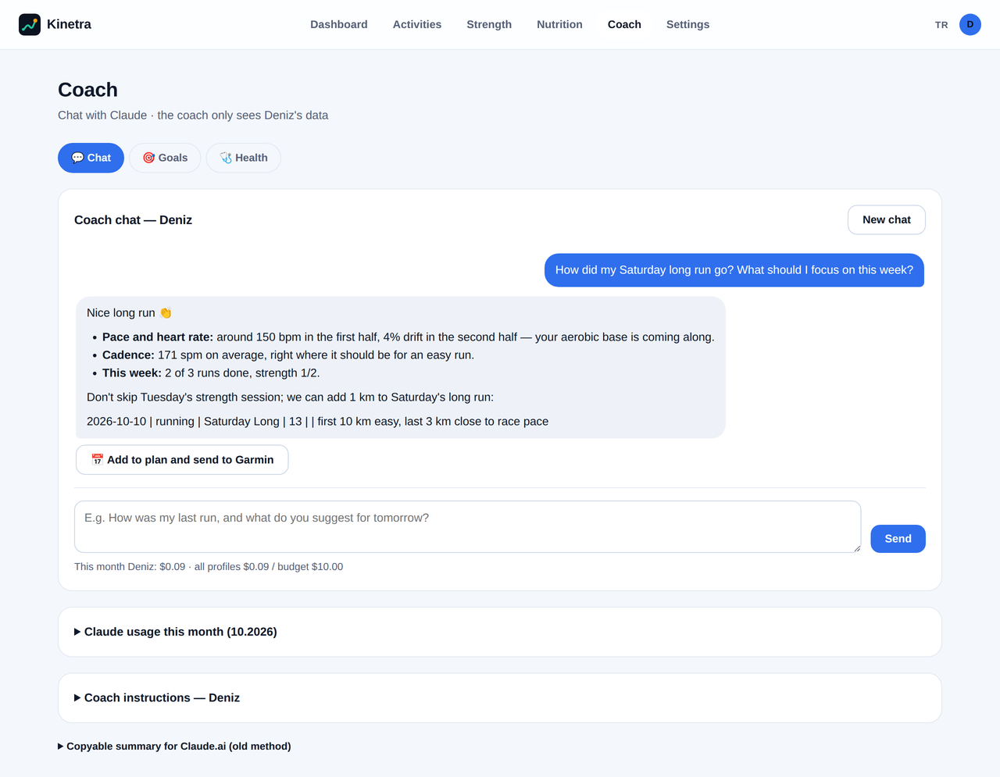
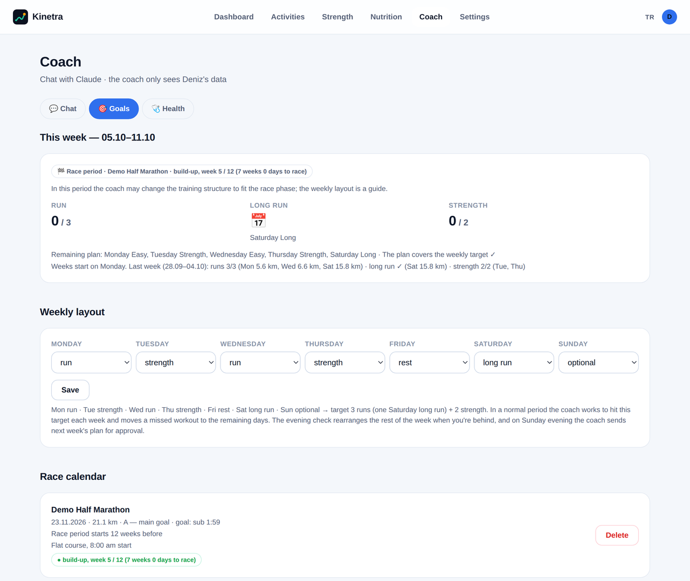
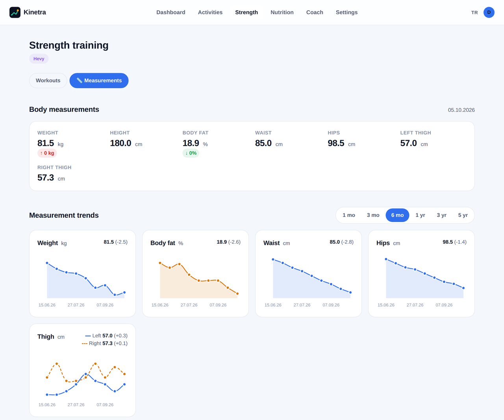
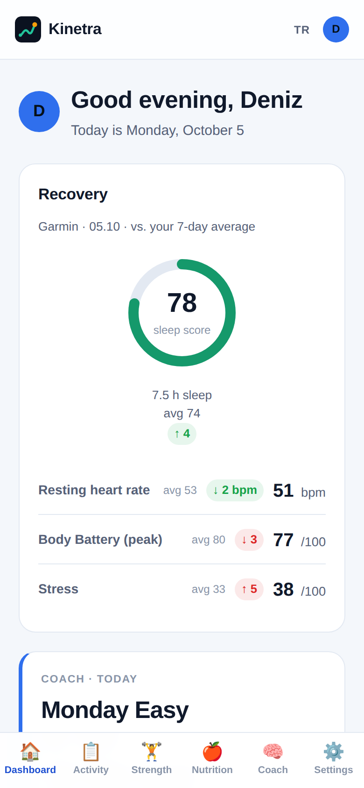
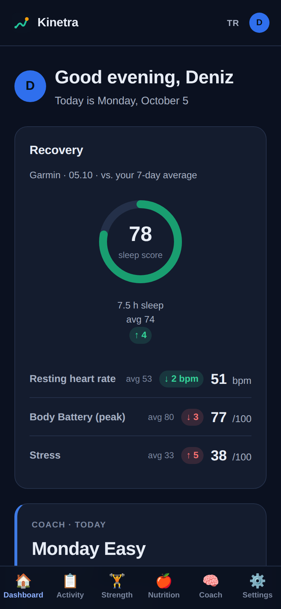

<p align="center"></p>

<h1 align="center">Kinetra</h1>

<p align="center">
A self-hosted training dashboard for runners who also lift: it merges Garmin, Strava, Hevy, and MyFitnessPal data, adds an AI coach (Claude), and lets you manage your plan from Telegram.
<br><br>
<a href="README.tr.md">Türkçe</a> · The UI is available in English and Turkish.
</p>

<p align="center"></p>

> All screenshots use the fictional demo data from `scripts/seed_demo.py`. No real person's data is shown.

## Why

Garmin Connect, Strava, Hevy, and MyFitnessPal each keep a slice of your training. Kinetra pulls them into one place for a household: several profiles on one server, each with their own accounts, goals and coach. It runs on a home server behind your own network or VPN, so your data stays with you.

## Features

**Today panel**
- Recovery card: sleep score, resting heart rate, Body Battery, and stress against your 7-day average.
- Today's planned workout from the coach, plus steps, weekly distance, and body trends.
- Light and dark mode, mobile layout with a bottom nav.

**Activities**
- Garmin and Strava duplicates of the same workout are merged.
- Route map, heart rate and elevation charts, km splits, aerobic decoupling.
- Running cadence is shown in steps per minute (Strava's single-leg values are doubled).

**Strength and body**
- Hevy workouts with sets, weights and volume.
- Body measurements with per-metric charts and a 1-month to 5-year range picker.

**Nutrition**
- MyFitnessPal calories and macros against your goals.

**Coach (Claude API, optional)**
- Per-profile chat. The coach automatically gets a fresh summary of the profile's data with each message.
- **Weekly target:** a weekly layout you choose (default: 3 runs including a Saturday long run, plus 2 strength sessions). Kinetra counts done, planned and missing sessions itself, and the coach fills the gaps in the rest of the week.
- **Race calendar:** an A-priority race switches the coach into race mode with build, taper, race-week and recovery phases.
- Suggested workouts can be added to the plan and pushed to your Garmin calendar with one click; an approved line replaces that day's unfinished plan.
- Monthly budget and per-message cost tracking.

**Telegram (optional)**
- One bot and group per profile; two-way chat with the coach.
- ✅ Done · ❌ Skipped · 📅 Move to tomorrow buttons on planned workouts. A skipped workout is removed from Garmin, and the coach can re-plan the week.
- 21:00 evening check, Sunday plan for the next week, `/plan`, `/week`, `/health` and `/doctor` commands.

**Languages**
- English and Turkish, chosen per profile. The interface, the coach's replies and that profile's Telegram bot all follow it; switch with the EN/TR button or under Settings.
- Translations live in `app/locales/en.json`, keyed by the Turkish source text, so adding a language is a matter of adding a catalog.

**Health**
- Reminders for periodic blood tests and cardiology check-ups.
- Upload lab PDFs or photos for Claude to summarize.
- Doctor notes take priority over the coach's own rules.

<table>
<tr>
<td></td>
<td></td>
</tr>
<tr>
<td></td>
<td></td>
</tr>
</table>

<p align="center">

&nbsp;&nbsp;

</p>

## Try it with demo data

No accounts needed:

```bash
git clone https://github.com/<user>/kinetra.git && cd kinetra
python3 -m venv venv && venv/bin/pip install -r requirements.txt
cp .env.example .env    # then put a key in FITDASH_ENCRYPTION_KEY (command is in the file)
FITDASH_DATABASE_URL=sqlite:///demo.db venv/bin/python scripts/seed_demo.py --lang en
FITDASH_DATABASE_URL=sqlite:///demo.db venv/bin/uvicorn app.main:app --port 8010
```

Then open `http://127.0.0.1:8010` and pick the **Deniz** or **Ece** profile.

## Setup with your own data

1. Install as above, fill in `.env` (every variable is explained in [`.env.example`](.env.example)), and start the app.
2. Create a profile per person.
3. Connect your accounts under **Ayarlar** (Settings):

| Source | What you need | Notes |
|---|---|---|
| Garmin Connect | Your Garmin email and password (MFA supported) | Uses the unofficial `garminconnect` library |
| Strava | `STRAVA_CLIENT_ID` / `STRAVA_CLIENT_SECRET` from [strava.com/settings/api](https://www.strava.com/settings/api) | New Strava apps allow only 1 athlete; a second profile can enter its own Strava app under Settings |
| Hevy | API key (Hevy Pro) | |
| MyFitnessPal | A session cookie copied from your browser | Unofficial; login with username and password isn't supported. Install separately: `pip install --no-deps myfitnesspal && pip install blessed rich browser_cookie3 cloudscraper measurement lxml` |
| Claude coach | `ANTHROPIC_API_KEY` | Optional. Set `FITDASH_COACH_MONTHLY_BUDGET_USD` as a spending cap |
| Telegram | A bot from @BotFather per profile, added under Settings | Optional. Link a group with `/link CODE` |

The database is SQLite; Postgres or Docker aren't needed. Credentials are stored Fernet-encrypted with `FITDASH_ENCRYPTION_KEY`.

## Security and privacy

- **No login.** Profiles are chosen by clicking, by design. Kinetra assumes it lives on your LAN or behind a VPN (for example WireGuard). **Never expose it directly to the internet.** Bind it to `127.0.0.1` and put nginx in front.
- **What leaves the server:**
  - Your data goes only to the services you connect: Garmin, Strava, Hevy, MyFitnessPal.
  - If you enable the coach, a summary of the profile's training, sleep and health notes goes to the Anthropic API.
  - With Telegram enabled, coach messages pass through Telegram.
- **Uploaded health files** are stored outside the static web folder and aren't served directly.
- `.env`, the database, uploads and certificates are in `.gitignore`.

## HTTPS on your home network

[`deploy/nginx.conf`](deploy/nginx.conf) is a reverse-proxy example for a private name such as `kinetra.internal` (`.internal` is reserved for private networks).

iPhones reject self-signed certificates valid for more than 825 days or missing the `serverAuth` usage. The reliable way is a small private CA, limited to `.internal` names:

```bash
openssl req -x509 -newkey rsa:4096 -nodes -keyout ca.key -out kinetra-ca.crt -days 3650 -subj "/CN=Home CA" \
  -addext "basicConstraints=critical,CA:TRUE,pathlen:0" -addext "keyUsage=critical,keyCertSign,cRLSign" \
  -addext "nameConstraints=critical,permitted;DNS:internal"
openssl req -newkey rsa:2048 -nodes -keyout kinetra.key -out kinetra.csr -subj "/CN=kinetra.internal"
printf "basicConstraints=critical,CA:FALSE\nkeyUsage=critical,digitalSignature,keyEncipherment\nextendedKeyUsage=serverAuth\nsubjectAltName=DNS:kinetra.internal\n" > leaf.cnf
openssl x509 -req -in kinetra.csr -CA kinetra-ca.crt -CAkey ca.key -CAcreateserial -days 730 -sha256 -extfile leaf.cnf -out kinetra.crt
```

Then:
1. Put `kinetra.crt` and `kinetra.key` into nginx.
2. Install `kinetra-ca.crt` on each phone in Safari.
3. On iPhone, turn it on under Settings → General → About → Certificate Trust Settings.
4. Keep `ca.key` private. Because of the name constraint, it can only sign `.internal` names.

## Project layout

```
app/
  main.py, config.py, db.py, models.py     FastAPI app, settings, SQLite models
  integrations/                            Garmin, Strava, Hevy, MyFitnessPal clients
  routers/                                 pages: panel, activities, strength, nutrition, coach, settings
  coach_chat.py                            Claude chat, cost tracking, prompt caching
  training.py                              weekly target, race phases
  telegram_bot.py, daily_check.py          Telegram bots and the evening check
  health.py                                check-up reminders, lab analysis
  i18n.py, locales/en.json                 language selection and the English catalog
  templates/, static/                      Jinja2 templates, CSS, charts
scripts/seed_demo.py                       fictional demo data
deploy/                                    nginx and systemd examples
```

## Limitations

- The Garmin Connect and MyFitnessPal integrations use unofficial libraries and can break when those services change. Check their terms before you use them.
- Kinetra is a personal project, not medical advice. The coach's suggestions don't replace a doctor or a qualified coach.

## License

[MIT](LICENSE)
