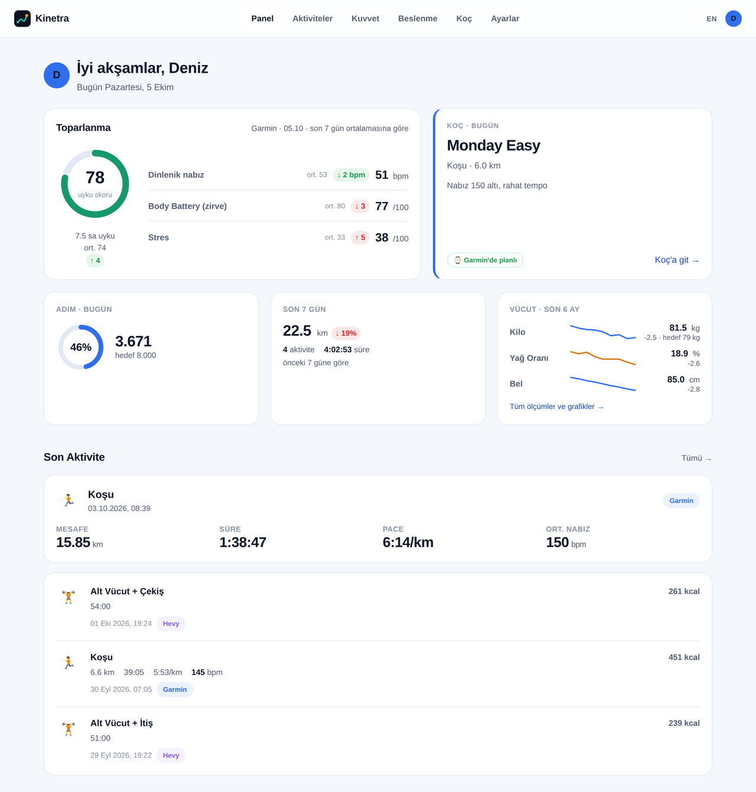
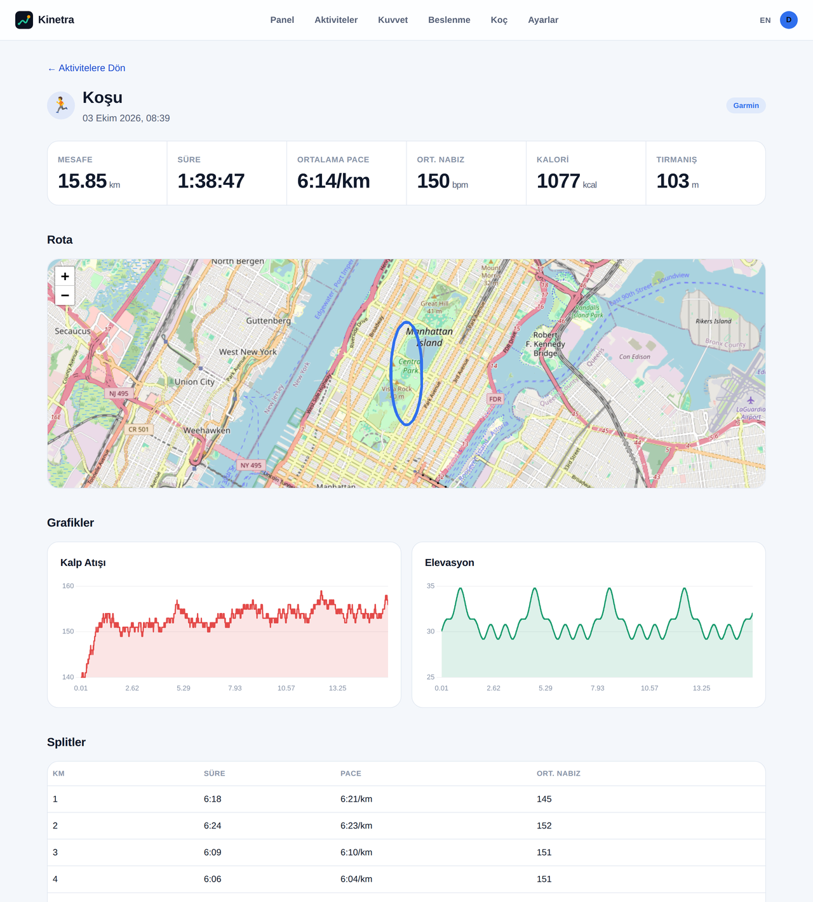
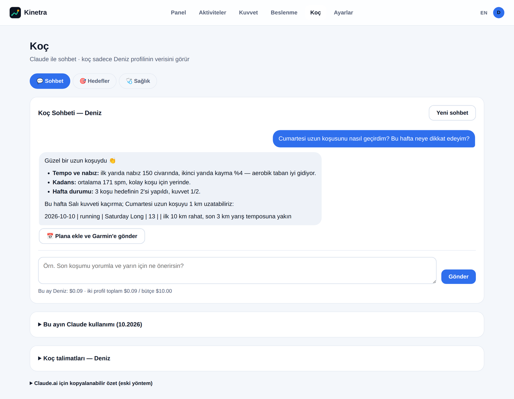
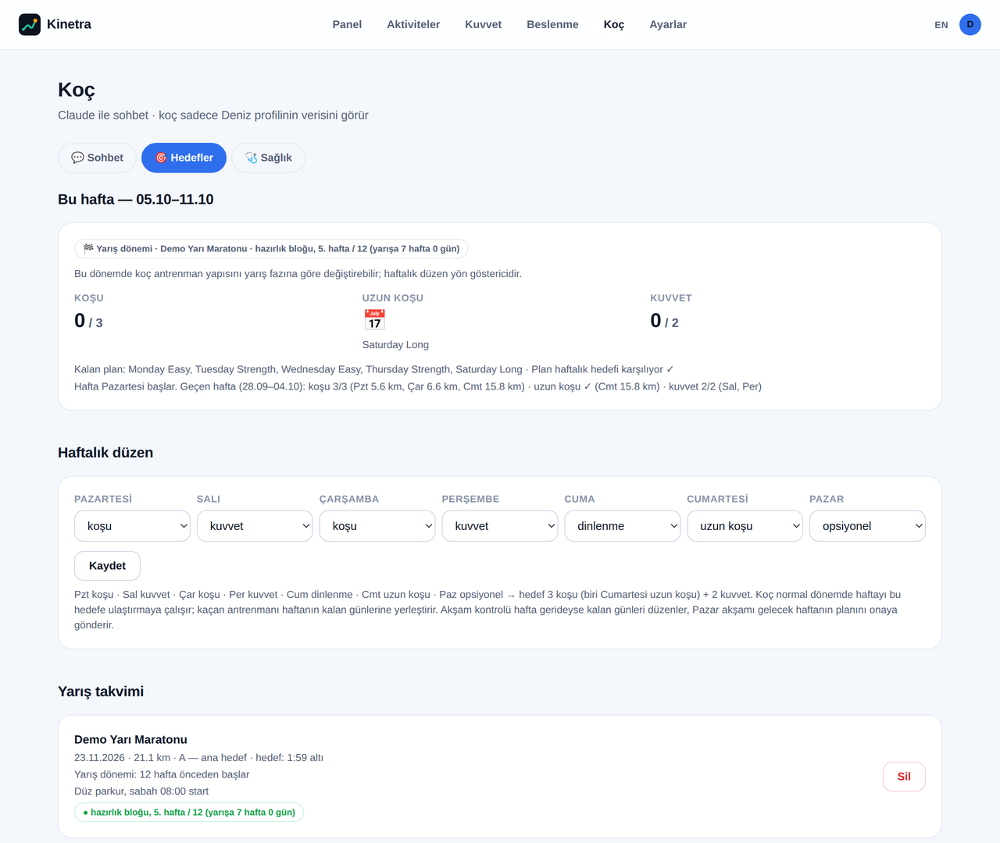
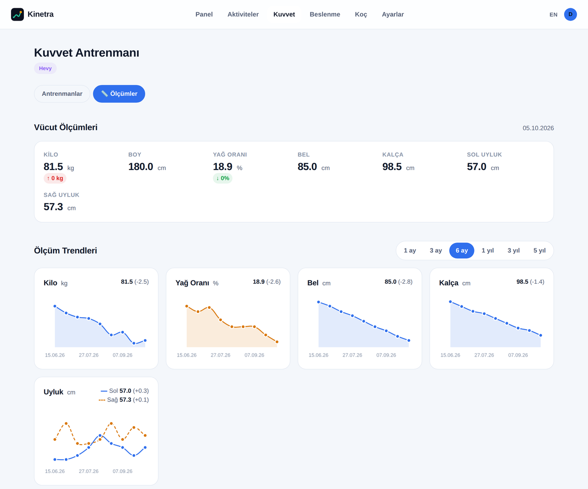
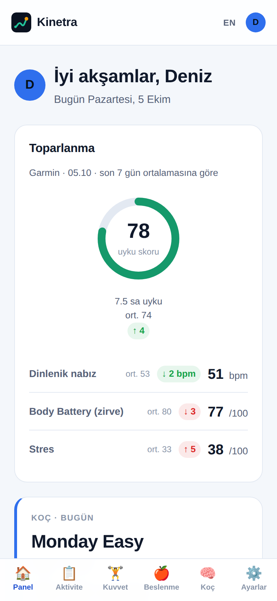
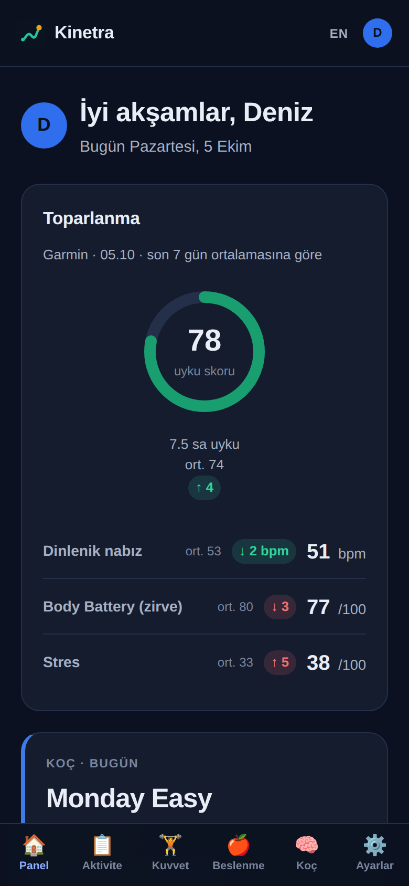

<p align="center"></p>

<h1 align="center">Kinetra</h1>

<p align="center">
Hem koşan hem salona giden sporcular için kendi sunucunda çalışan bir antrenman paneli. Garmin, Strava, Hevy ve MyFitnessPal verilerini birleştirir, Claude ile çalışan bir koç ekler ve planını Telegram'dan yönetmeni sağlar.
<br><br>
<a href="README.md">English</a> · Arayüz Türkçe ve İngilizce.
</p>

<p align="center"></p>

> Ekran görüntülerindeki tüm veriler `scripts/seed_demo.py` ile üretilmiş kurgusal demo verisidir; gerçek bir kişiye ait değildir.

## Neden

Saat, koşu uygulaması, salon kaydı ve beslenme günlüğü antrenmanının ayrı birer parçasını tutar. Kinetra bunları bir hane için tek yerde toplar: bir sunucuda birden fazla profil, her birinin kendi hesapları, hedefleri ve koçu. Ev ağında ya da VPN arkasında çalışır; veriler sende kalır.

## Özellikler

**Bugün paneli**
- Toparlanma kartı: uyku skoru, dinlenik nabız, Body Battery ve stres, 7 günlük ortalamana göre.
- Koçun bugünkü planı, adım, haftalık mesafe ve vücut trendleri.
- Açık ve koyu tema, alt menülü mobil düzen.

**Aktiviteler**
- Aynı antrenmanın Garmin ve Strava kopyaları birleştirilir.
- Rota haritası, nabız ve yükseklik grafikleri, km splitleri, aerobik decoupling.
- Koşu kadansı adım/dk olarak gösterilir (Strava'nın tek bacak değerleri ikiyle çarpılır).

**Kuvvet ve vücut**
- Hevy antrenmanları: set, ağırlık ve hacim.
- Vücut ölçümleri: her ölçüm için grafik ve 1 ay–5 yıl aralık seçici.

**Beslenme**
- MyFitnessPal kalori ve makroları, hedeflerinle birlikte.

**Koç (Claude API, isteğe bağlı)**
- Profil başına sohbet. Koç, her mesajda profilin güncel veri özetini otomatik olarak alır.
- **Haftalık hedef:** seçtiğin haftalık düzen (varsayılan: biri Cumartesi uzun koşu olmak üzere 3 koşu + 2 kuvvet). Yapılan, planlanan ve eksik antrenmanları Kinetra kendisi sayar; koç eksikleri haftanın kalan günlerine yerleştirir.
- **Yarış takvimi:** A öncelikli bir yarış, koçu hazırlık, taper, yarış haftası ve toparlanma fazlarıyla yarış dönemine geçirir.
- Önerilen antrenmanlar tek tıkla plana eklenir ve Garmin takvimine gönderilir; onaylanan satır o günün yapılmamış planının yerine geçer.
- Aylık bütçe ve mesaj başına maliyet takibi.

**Telegram (isteğe bağlı)**
- Her profile ayrı bot ve grup; koçla iki yönlü sohbet.
- Planlı antrenmanlarda ✅ Yapıldı · ❌ Yapılmadı · 📅 Yarına taşı butonları. Yapılmayan antrenman Garmin'den kaldırılır ve koç haftayı yeniden planlayabilir.
- 21:00 akşam kontrolü, Pazar akşamı gelecek haftanın planı, `/plan`, `/hafta`, `/saglik` ve `/doktor` komutları (İngilizce karşılıkları: `/week`, `/health`, `/doctor`).

**Diller**
- Türkçe ve İngilizce, profil başına seçilir. Arayüz, koçun cevapları ve o profilin Telegram botu bu dili kullanır; üst menüdeki TR/EN düğmesi veya Ayarlar'dan değiştirilir.
- Çeviriler `app/locales/en.json` içinde, Türkçe kaynak metin anahtarıyla durur; yeni bir dil eklemek için bir katalog eklemek yeterli.

**Sağlık**
- Periyodik kan tahlili ve kardiyoloji kontrolü hatırlatmaları.
- Tahlil PDF'i veya fotoğrafı yükle, Claude özetlesin.
- Doktor notları, koçun kendi kurallarının önüne geçer.

<table>
<tr>
<td></td>
<td></td>
</tr>
<tr>
<td></td>
<td></td>
</tr>
</table>

<p align="center">

&nbsp;&nbsp;

</p>

## Demo veriyle dene

Hesap bağlamak gerekmez:

```bash
git clone https://github.com/<kullanici>/kinetra.git && cd kinetra
python3 -m venv venv && venv/bin/pip install -r requirements.txt
cp .env.example .env    # FITDASH_ENCRYPTION_KEY'e anahtar yaz (komut dosyada)
FITDASH_DATABASE_URL=sqlite:///demo.db venv/bin/python scripts/seed_demo.py
FITDASH_DATABASE_URL=sqlite:///demo.db venv/bin/uvicorn app.main:app --port 8010
```

Ardından `http://127.0.0.1:8010` adresini aç ve **Deniz** ya da **Ece** profilini seç.

## Kendi verinle kurulum

1. Yukarıdaki gibi kur, `.env` dosyasını doldur (tüm değişkenler [`.env.example`](.env.example) içinde açıklanıyor) ve uygulamayı başlat.
2. Her kişi için bir profil oluştur.
3. Hesaplarını **Ayarlar** sayfasından bağla:

| Kaynak | Gerekenler | Not |
|---|---|---|
| Garmin Connect | Garmin e-posta ve şifren (MFA destekli) | Resmi olmayan `garminconnect` kütüphanesi |
| Strava | [strava.com/settings/api](https://www.strava.com/settings/api) üzerinden `STRAVA_CLIENT_ID` / `STRAVA_CLIENT_SECRET` | Yeni Strava uygulamaları 1 sporcuyla sınırlı; ikinci profil kendi Strava uygulamasını Ayarlar'dan girebilir |
| Hevy | API anahtarı (Hevy Pro) | |
| MyFitnessPal | Tarayıcından kopyalanan oturum çerezi | Resmi değil; kullanıcı adı ve şifreyle giriş desteklenmiyor. Ayrı kurulur: `pip install --no-deps myfitnesspal && pip install blessed rich browser_cookie3 cloudscraper measurement lxml` |
| Claude koç | `ANTHROPIC_API_KEY` | İsteğe bağlı. Harcama sınırı için `FITDASH_COACH_MONTHLY_BUDGET_USD` |
| Telegram | Her profil için @BotFather'dan bir bot, Ayarlar'dan eklenir | İsteğe bağlı. Grubu `/bagla KOD` ile bağla |

Veritabanı SQLite'tır; Postgres ya da Docker gerekmez. Kimlik bilgileri `FITDASH_ENCRYPTION_KEY` ile Fernet şifreli saklanır.

## Güvenlik ve gizlilik

- **Giriş ekranı yok.** Profiller tıklanarak seçilir; bu bilinçli bir tercih. Kinetra'nın ev ağında ya da bir VPN (örn. WireGuard) arkasında çalıştığı varsayılır. **Uygulamayı asla doğrudan internete açma.** `127.0.0.1`'e bağla ve önüne nginx koy.
- **Sunucudan dışarı ne çıkar:**
  - Verilerin yalnızca bağladığın servislere gider: Garmin, Strava, Hevy, MyFitnessPal.
  - Koçu açarsan profilin antrenman, uyku ve sağlık notları özeti Anthropic API'ye gider.
  - Telegram açıksa koç mesajları Telegram üzerinden geçer.
- **Yüklenen sağlık dosyaları** statik web klasörünün dışında saklanır ve doğrudan sunulmaz.
- `.env`, veritabanı, yüklenen dosyalar ve sertifikalar `.gitignore` içindedir.

## Ev ağında HTTPS

[`deploy/nginx.conf`](deploy/nginx.conf), `kinetra.internal` gibi özel bir ad için ters vekil (reverse proxy) örneğidir (`.internal` özel ağlar için ayrılmıştır).

iPhone'lar 825 günden uzun geçerli olan veya `serverAuth` kullanımı olmayan self-signed sertifikaları reddeder. Güvenilir yol, yalnızca `.internal` adlarıyla sınırlı küçük bir özel CA'dır. Komutlar [İngilizce README](README.md#https-on-your-home-network) içinde.

Sonra:
1. `kinetra.crt` ve `kinetra.key` dosyalarını nginx'e koy.
2. `kinetra-ca.crt` dosyasını her telefona Safari ile yükle.
3. iPhone'da Ayarlar → Genel → Hakkında → Sertifika Güven Ayarları altından aç.
4. `ca.key` dosyasını gizli tut. Ad kısıtı sayesinde yalnızca `.internal` adları için sertifika imzalayabilir.

## Proje yapısı

```
app/
  main.py, config.py, db.py, models.py     FastAPI uygulaması, ayarlar, SQLite modelleri
  integrations/                            Garmin, Strava, Hevy, MyFitnessPal istemcileri
  routers/                                 sayfalar: panel, aktiviteler, kuvvet, beslenme, koç, ayarlar
  coach_chat.py                            Claude sohbeti, maliyet takibi, prompt önbelleği
  training.py                              haftalık hedef, yarış fazları
  telegram_bot.py, daily_check.py          Telegram botları ve akşam kontrolü
  health.py                                kontrol hatırlatmaları, tahlil yorumu
  i18n.py, locales/en.json                 dil seçimi ve İngilizce katalog
  templates/, static/                      Jinja2 şablonları, CSS, grafikler
scripts/seed_demo.py                       kurgusal demo verisi
deploy/                                    nginx ve systemd örnekleri
```

## Sınırlamalar

- Garmin Connect ve MyFitnessPal entegrasyonları resmi olmayan kütüphaneler kullanır; bu servisler değiştiğinde bozulabilir. Kullanmadan önce kullanım koşullarına bak.
- Kinetra kişisel bir projedir, tıbbi tavsiye değildir. Koçun önerileri bir doktorun ya da yetkin bir antrenörün yerini tutmaz.

## Lisans

[MIT](LICENSE)
